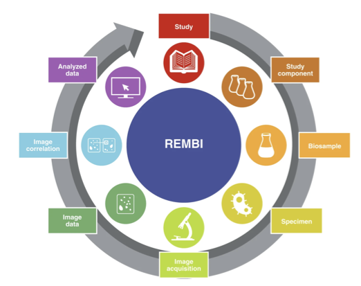

REMBI Overview
---------------------------------------

Scientific research and development relies on FAIR sharing of the data that support results and conclusions. That is, the data needs to be **F**indable, **A**ccessible, **I**nteroperable, and **R**eusable. The guidelines and principles of FAIR data can be found in [this paper](https://www.nature.com/articles/sdata201618) and the [FAIR sharing website](https://fairsharing.org/).

**Metadata** accompanying the data is key to providing all four building blocks of FAIR data. Metadata is what enables researchers to make sense of the data. [Recommended Metadata for Biological Images (REMBI)](https://doi.org/10.1038/s41592-021-01166-8) provides guidelines for metadata for biological images to enable the FAIR sharing of scientific data. REMBI is the result of the bioimaging community coming together to develop metadata standards that describe the imaging data itself, together with supporting metadata such as those describing the biological study and sample. It will also help enable automated data harvesting using machine learning techniques.

REMBI has an 8-component high level structure to encompass diverse biological imaging methods and subdomains.

The BioImage Archive has adopted REMBI as its metadata model, therefore when you submit image data to the Archive, you will be asked to supply information about each of the relevant REMBI components. 

* **Study** is the highest level metadata, describing your project, including funding and publications.

* **Study Component** acts as a container that helps you organise your data, based on experiment types or samples etc. A Study Component contains one or more of the following components: biosample, specimen, image acquisition, image correlation, image analysis (latter two are only required if relevant).

* **Biosample** is about what it is you have imaged, for example, the species of the organism that you’re imaging, if you’re using a particular cell line, genetic background etc. 

* **Specimen** metadata describes how your sample was prepared for imaging.

* **Image Acquisition** is about how your images were captured. 

* **Image Data** contains image level metadata. This is implemented as the [File List](/helpfilelist) for BioImage Archive submissions, instead of a seperate component in the submission form. 

* **Image Correlation** is optional and contains metadata about correlating images from different modalities. 

* **Analysed Data**, includes **Image Analysis** metadata; information about how you analysed your images, if applicable.   

Detailed definitions and examples of the REMBI metadata can be found under the REMBI Help tab on the BioImage Archive website.
